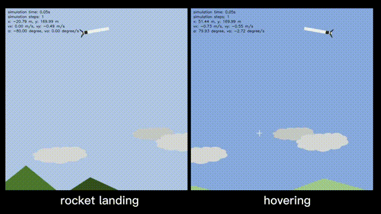
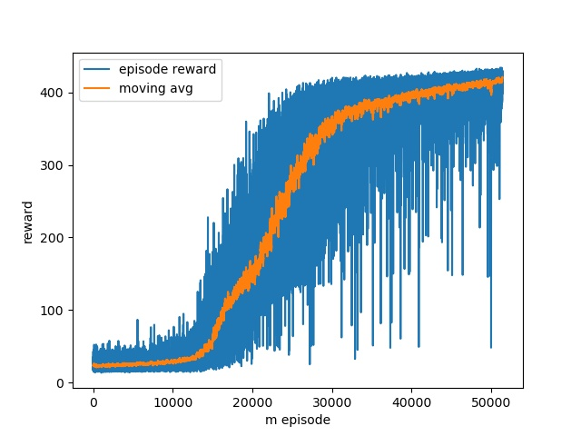

# Rocket-recycling with Reinforcement Learning

Developed by: [Zhengxia Zou](https://zhengxiazou.github.io/)

[](https://www.youtube.com/watch?v=-kiGmCmnSM0)

I have long been fascinated by the recovery process of SpaceX rockets. In this mini-project, I worked on an interesting question that whether we can address this problem with simple reinforcement learning. 

I tried on two tasks: **hovering** and **landing**. The rocket is simplified into a rigid body on a 2D plane with a thin rod, considering the basic cylinder dynamics model and air resistance proportional to the velocity.

Their reward functions are quite straightforward.

1. For the hovering tasks: the step-reward is given based on two factors:
   1) the distance between the rocket and the predefined target point - the closer they are, the larger reward will be assigned.
   2) the angle of the rocket body (the rocket should stay as upright as possible)

1. For the landing task: the step-reward is given based on three factors:
   1) and 2) are the same as the hovering task
   3) Speed and angle at the moment of contact with the ground - when the touching-speed
   are smaller than a safe threshold and the angle is close to 90 degrees (upright), we see it as a successful landing and a big reward will be assigned. 

A thrust-vectoring engine is installed at the bottom of the rocket. This engine provides different thrust values (0, 0.5g, and 1.5g) with three different angles (-15, 0, and +15 degrees). 


The action space is defined as a collection of the discrete control signals of the engine. The state-space consists of the rocket position (x, y), speed (vx, vy), angle (a), angle speed (va), and the simulation time steps (t).


I implement the above environment and train a policy-based agent (actor-critic) on solving this problem. The episode reward finally converges very well after over 40000 training episodes.





Despite the simple setting of the environment and the reward, the agent successfully learned the starship classic belly flop maneuver, which makes me quite surprising.  The following animation shows a comparison between the real SN10 and a fake one learned from reinforcement learning.


## Requirements

See [Requirements.txt](Requirements.txt).

## Usage

To train an agent, see `./example_train.py`

To test an agent:

```python
import torch
from rocket import Rocket
from policy import ActorCritic
import os
import glob

# Decide which device we want to run on
device = torch.device("cuda:0" if torch.cuda.is_available() else "cpu")

if __name__ == '__main__':

    task = 'hover'  # 'hover' or 'landing'
    max_steps = 800
    ckpt_dir = glob.glob(os.path.join(task+'_ckpt', '*.pt'))[-1]  # last ckpt

    env = Rocket(task=task, max_steps=max_steps)
    net = ActorCritic(input_dim=env.state_dims, output_dim=env.action_dims).to(device)
    if os.path.exists(ckpt_dir):
        checkpoint = torch.load(ckpt_dir)
        net.load_state_dict(checkpoint['model_G_state_dict'])

    state = env.reset()
    for step_id in range(max_steps):
        action, log_prob, value = net.get_action(state)
        state, reward, done, _ = env.step(action)
        env.render(window_name='test')
        if env.already_crash:
            break
```

## License

<a rel="license" href="http://creativecommons.org/licenses/by-nc-sa/4.0/"></a><span xmlns:dct="http://purl.org/dc/terms/" property="dct:title">  Rocket-recycling</span> by <a xmlns:cc="http://creativecommons.org/ns#" href="http://www-personal.umich.edu/~zzhengxi/">Zhengxia Zou</a> is licensed under a <a rel="license" href="http://creativecommons.org/licenses/by-nc-sa/4.0/">Creative Commons Attribution-NonCommercial-ShareAlike 4.0 International License</a>.

## Citation

``````
@misc{zou2021rocket,
  author = {Zhengxia Zou},
  title = {Rocket-recycling with Reinforcement Learning},
  year = {2021},
  publisher = {GitHub},
  journal = {GitHub repository},
  howpublished = {\url{https://github.com/jiupinjia/rocket-recycling}}
}
``````